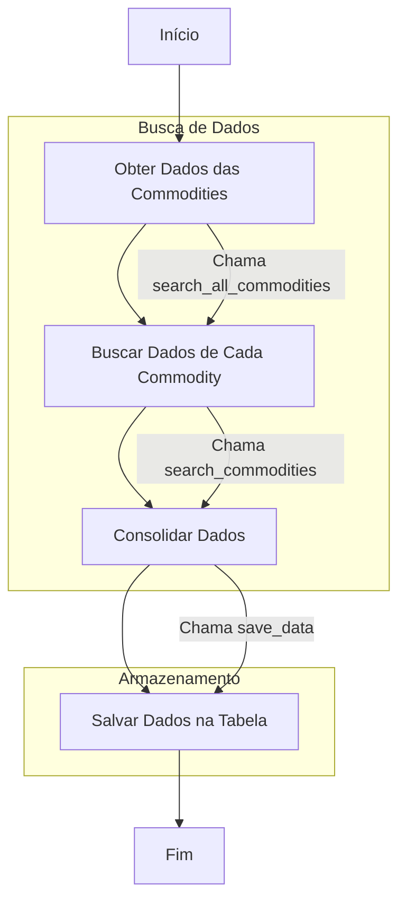

# Commodities Data Warehouse

Este projeto é uma [**Data Warehouse de commodities**](https://www.youtube.com/watch?v=n3R0c2ZB6BQ) que utiliza a API do [Yahoo Finance](https://pypi.org/project/yfinance/) para extrair dados, armazená-los em um banco de dados PostgreSQL hospedado no [Render](https://render.com/) e realizar transformações utilizando o [DBT](https://docs.getdbt.com/). O objetivo é construir um pipeline de ETL (Extract, Transform, Load) para a análise de dados de commodities.

## Índice

- [Visão Geral](#visão-geral)
- [Dependências](#dependências)
- [Instalação e Configuração](#instalação-e-configuração)
- [Execução](#execução)
- [Workflow do Projeto](#workflow-do-projeto)
- [Estrutura do Projeto](#estrutura-do-projeto)

## Visão Geral

O **Commodities Data Warehouse** é composto por um pipeline que:

1. **Extrai dados** de commodities de uma API (Yahoo Finance).
2. **Transforma os dados** em tabelas estruturadas e padronizadas.
3. **Armazena os dados** no banco de dados PostgreSQL para facilitar análises.

O DBT é usado para aplicar camadas de transformação e preparar os dados para análises mais profundas, separando-os em camadas de staging e datamart.

## Dependências

As dependências para este projeto são:

```plaintext
pandas>=2.2.2
sqlalchemy>=2.0.34
python-dotenv>=1.0.1
psycopg2-binary>=2.9.9
yfinance>=0.2.43
dbt-postgres>=1.8.2
streamlit>=1.38.0
```

## Instalação e Configuração

### Pré-requisitos

- **Python 3.11+**
- **PostgreSQL**
- **DBT**

### Passos de Instalação

1. **Clone o repositório**:

   ```bash
   git clone <URL-do-repositorio>
   cd commodities_data_warehouse
   ```

2. **Configure as variáveis de ambiente**:
Crie um arquivo .env na raiz do projeto com as seguintes variáveis:

    ```bash
    DB_HOST_PROD=<>
    DB_PORT_PROD=<>
    DB_NAME_PROD=<>
    DB_USER_PROD=<>
    DB_PASSWORD_PROD=<>
    DB_SCHEMA_PROD=<>
    DB_THREADS_PROD=<>
    DB_TYPE_PROD=<>
    DBT_PROFILES_DIR=../
    ```

## Execução

1. **Executar a Extração de Dados**
Rode o script para extrair os dados de commodities da API yfinance:

    ```bash
    python extract_data.py
    ```

2. **Rodar Seeds com o DBT**
Inicie o DBT para carregar dados estáticos (seeds):

    ```bash
    dbt seed
    ```

3. **Rodar as Transformações**
Execute as transformações do DBT para criar as tabelas finais:

    ```bash
    dbt run
    ```

4. **Iniciar o Streamlit**
Inicie o streamlit para visualização dos dados:

    ```bash
    streamlit run app.py
    ```

## Workflow do Projeto



### Descrição do Processo

1. **Extrair Dados da API**: Coleta de dados de commodities da API ``yfinance``.
2. **Processar Dados com Pandas**: Manipulação e organização dos dados em dataframes.
3. **Salvar no Banco PostgreSQL**: Armazenamento dos dados no servidor PostgreSQL.
4. **Executar DBT**: Iniciar o processo de transformação com o DBT.
5. **Transformar Dados na Camada Staging**: Realiza a limpeza e padronização dos dados.
6. **Aplicar Modelos de Datamart**: Cria e aplica modelos para análise dos dados.
7. **Visualizar Dados no Streamlit**: Gera um dashboard interativo utilizando Streamlit com os dados processados.

## Estrutura do Projeto

A estrutura de pastas do projeto é organizada da seguinte forma:

```plaintext
├── .gitignore
├── .user.yml
├── README.md
├── app
│   └── app.py
├── datawarehouse
│   ├── .gitignore
│   ├── README.md
│   ├── dbt_project.yml
│   ├── docs
│   │   └── homepage.md
│   ├── models
│   │   ├── datamart
│   │   │   ├── dm_commodities.sql
│   │   │   └── schema.yml
│   │   ├── staging
│   │   │   ├── stg_commodities.sql
│   │   │   ├── stg_commodities_moviment.sql
│   │   │   └── schema.yml
│   │   └── schema.yml
│   ├── seeds
│   │   ├── .gitkeep
│   │   └── commodities_moviment.csv
├── example.env
├── profiles.yml
├── pyproject.toml
├── src
│   └── commodities_data_warehouse
│       └── extract_data.py
└── uv.lock
```

### Diretórios Principais

1. **`models`**: Contém os arquivos SQL do DBT que definem as transformações dos dados.
2. **`seeds`**: Armazena arquivos CSV de dados estáticos que são carregados como seeds no PostgreSQL.
3. **`extract_data.py`**: Script que extrai dados de commodities da API yfinance.
4. **`app.py`**: Script para visualizar os dados com streamlit.
