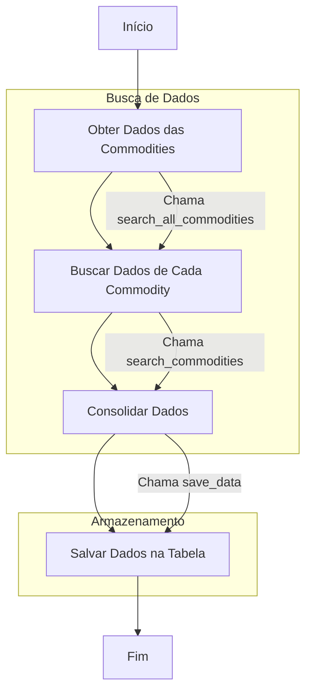

# Workflow

```mermaid
graph TD
    A[Início] --> B[Obter Dados das Commodities]

    subgraph Busca de Dados
        B --> C[Buscar Dados de Cada Commodity]
        C --> D[Consolidar Dados]
    end

    subgraph Armazenamento
        D --> E[Salvar Dados na Tabela]
    end

    E --> F[Fim]

    %% Detalhamento das etapas
    B --> |"Chama search_all_commodities"| C
    C --> |"Chama search_commodities"| D
    D --> |"Chama save_data"| E

```
