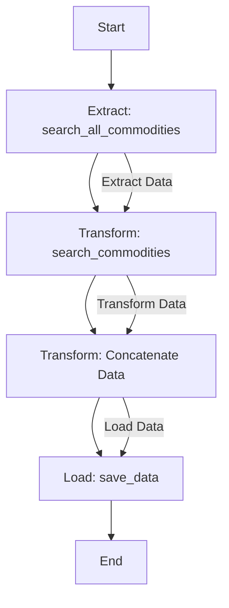

# Workflow

```mermaid
flowchart TD
    A[Start] --> B[Extract: search_all_commodities]
    B --> C[Transform: search_commodities]
    C --> D[Transform: Concatenate Data]
    D --> E[Load: save_data]
    E --> F[End]

    %% Define the links between the elements
    B -->|Extract Data| C
    C -->|Transform Data| D
    D -->|Load Data| E
```
