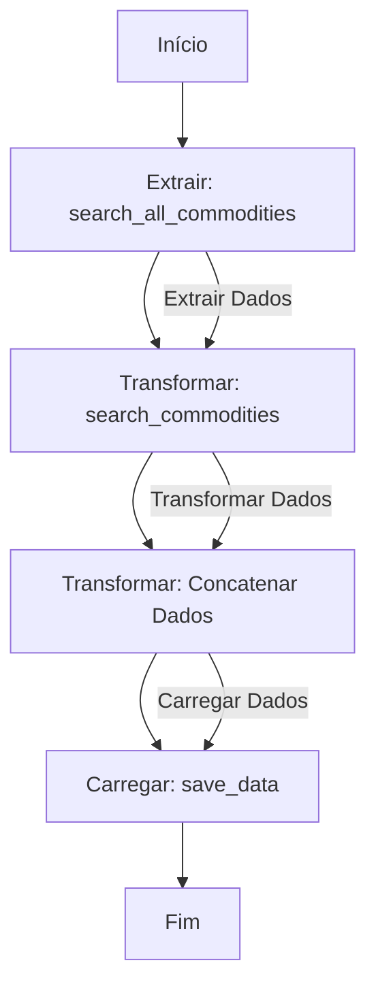

# Workflow

```mermaid
flowchart TD
    A[Início] --> B[Extrair: search_all_commodities]
    B --> C[Transformar: search_commodities]
    C --> D[Transformar: Concatenar Dados]
    D --> E[Carregar: save_data]
    E --> F[Fim]

    %% Definir os links entre os elementos
    B -->|Extrair Dados| C
    C -->|Transformar Dados| D
    D -->|Carregar Dados| E
```
