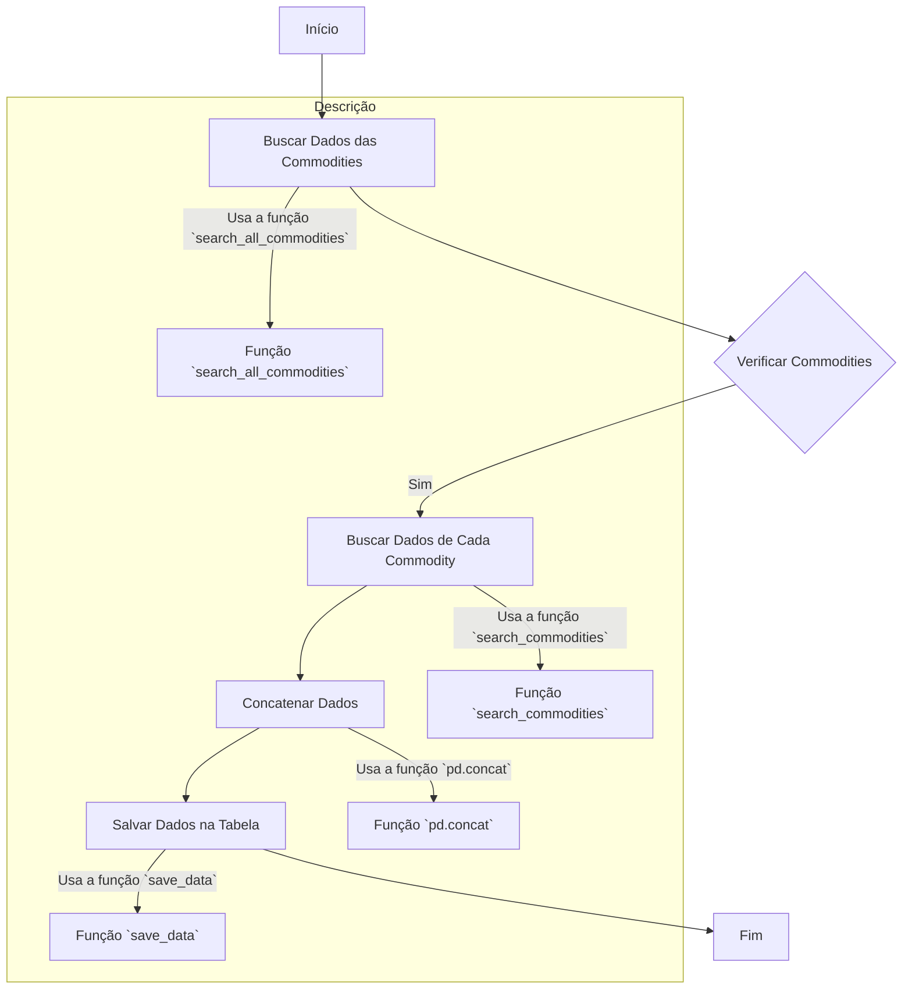

# Workflow

```mermaid
graph TD
    A[Início] --> B[Buscar Dados das Commodities]
    B --> C{Verificar Commodities}
    C -->|Sim| D[Buscar Dados de Cada Commodity]
    D --> E[Concatenar Dados]
    E --> F[Salvar Dados na Tabela]
    F --> G[Fim]

    %% Descrição das etapas
    subgraph Descrição
        B[Buscar Dados das Commodities] -->|Usa a função `search_all_commodities`| B1[Função `search_all_commodities`]
        D[Buscar Dados de Cada Commodity] -->|Usa a função `search_commodities`| D1[Função `search_commodities`]
        E[Concatenar Dados] -->|Usa a função `pd.concat`| E1[Função `pd.concat`]
        F[Salvar Dados na Tabela] -->|Usa a função `save_data`| F1[Função `save_data`]
    end
```
