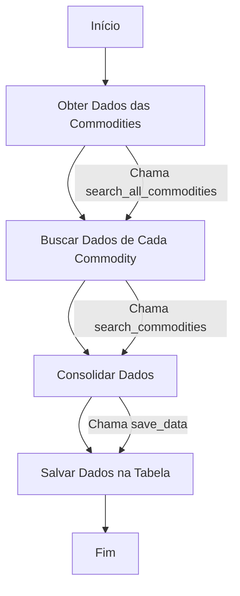

# Workflow

```mermaid
graph TD
    A[Início] --> B[Obter Dados das Commodities]
    B --> C[Buscar Dados de Cada Commodity]
    C --> D[Consolidar Dados]
    D --> E[Salvar Dados na Tabela]
    E --> F[Fim]

    %% Detalhamento das etapas
    B --> |"Chama search_all_commodities"| C
    C --> |"Chama search_commodities"| D
    D --> |"Chama save_data"| E
```
